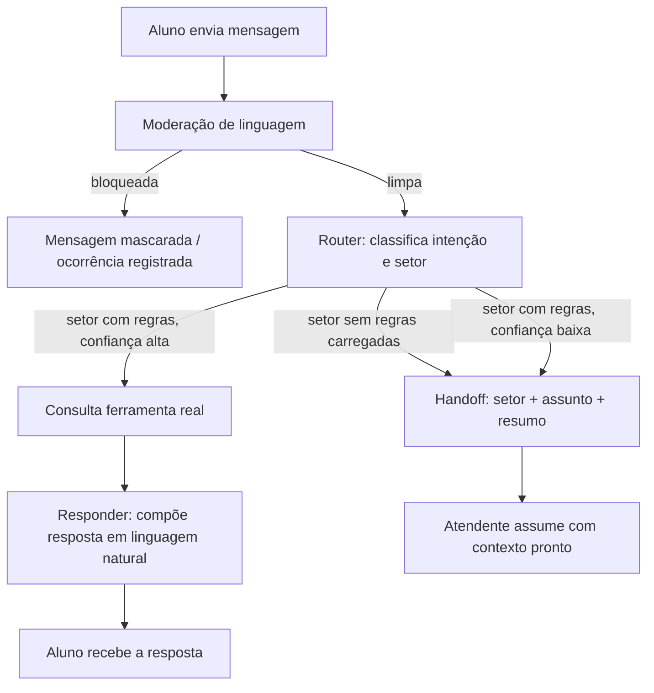

# UniFatecie — Atendimento IA

Camada de inteligência artificial acoplável à Mensageria da UniFatecie: classifica automaticamente
qualquer atendimento pelo setor certo e resolve sozinha as dúvidas onde já existe uma base de
conhecimento carregada, escalando para um atendente humano — com contexto completo — sempre que não sabe
responder.

Este repositório contém o motor (backend + IA) e um frontend de demonstração construído para validar o
comportamento ponta a ponta antes de qualquer integração com a plataforma real.

> **Primeiro módulo em funcionamento:** Estágio Supervisionado Obrigatório de Pedagogia, com as diretrizes
> reais do setor carregadas como base de conhecimento (RAG). Os demais setores (Financeiro, Secretaria,
> TCC etc.) seguem o mesmo padrão de arquitetura e entram conforme suas diretrizes forem documentadas.

---

## Como funciona



A decisão de responder ou encaminhar nunca é "livre": a IA só responde quando uma ferramenta controlada
devolve um dado real (status do aluno, regra da base de conhecimento), nunca por inferência própria. Dois
prompts separados — um que só classifica (saída estruturada em JSON) e outro que só escreve a resposta
final — evitam que JSON interno vaze para o aluno e mantêm cada responsabilidade isolada e testável.

## Primeiro módulo: Estágio Obrigatório de Pedagogia

As diretrizes reais do setor (elegibilidade, carga horária por etapa, fluxo de Termo de Compromisso,
dispensa por atividade profissional, convalidação de estágio não obrigatório, Relatório Final e prazos)
foram carregadas como base vetorial (`pgvector`) e como regras de domínio no modelo de dados. A IA nunca
calcula percentuais ou horas restantes por conta própria — todo dado individual do aluno vem de uma
consulta real ao sistema.

## Métricas (Golden Dataset)

O comportamento da IA é validado contra um conjunto de casos reais de atendimento, executado
automaticamente a cada mudança de prompt:

| Métrica | Resultado |
|---|---|
| Tool Selection Accuracy | 100% |
| Handoff Accuracy | 100% |
| Moderation Accuracy | 100% |

```bash
docker compose run --rm backend python manage.py run_golden_dataset
```

## Governança

- **Moderação de linguagem** aplicada a aluno e atendente — mensagem mascarada, ocorrência registrada,
  atendimento nunca travado.
- **Auditoria por execução de IA**: provider, modelo, versão do prompt, confiança, ferramenta usada,
  resultado — tudo rastreável por atendimento.
- **Versionamento de prompt** (`PROMPT_VERSION`): nenhuma mudança de comportamento é feita sem registro de
  qual versão respondeu o quê.

## Stack

| Camada | Tecnologia |
|---|---|
| Backend | Django 5 + Django REST Framework |
| Banco de dados | PostgreSQL com `pgvector` (busca semântica) |
| Fila / agendamento | Redis + Celery (`celery-beat` para a regra de avaliação automática em 24h) |
| IA | Claude (Anthropic API) — arquitetura `AIProvider` plugável, também testada com Gemini e Ollama |
| Frontend (demonstração) | React 18 + TypeScript + Vite, React Query, Zustand |

## Estrutura do repositório

```
backend/
  apps/
    accounts/       # usuário e papéis (Aluno, Atendente)
    students/       # alunos, matrículas, atividades, seed de demonstração
    academic/       # cursos e disciplinas
    finance/        # dados financeiros simulados
    internship/     # modelo de domínio do Estágio Obrigatório (etapas, dispensas, relatório final)
    support/        # ticket, mensagens, fila de atendimento
    moderation/      # validação de linguagem e ocorrências
    evaluations/     # avaliação do atendimento (estrelas + regra das 24h)
    ai/              # prompts, providers, ferramentas, RAG, Golden Dataset
    integrations/    # AcademicConnector — camada única de acesso a dados
  config/            # settings, urls, celery
frontend/
  src/
    pages/           # telas de aluno e atendente
    components/      # chat, triagem, resumo acadêmico, selos de status
    api/              # client HTTP e contratos de tipo
docs/
  regulamento/        # regulamento do prêmio e diretrizes internas usadas como base de conhecimento
  ARQUITETURA.md, METODOLOGIA.md, PLANO_FUTURO.md, APRESENTACAO.md
```

## Rodando localmente

Pré-requisitos: Docker e Docker Compose.

```bash
cp .env.example .env
```

Edite o `.env` e defina pelo menos uma chave de IA (`ANTHROPIC_API_KEY` ou `GEMINI_API_KEY`) e
`AI_PROVIDER` (`claude`, `gemini` ou `local`, para rodar com Ollama sem depender de API externa).

```bash
docker compose up -d
docker compose exec backend python manage.py migrate
docker compose exec backend python manage.py seed_demo --students 10000
docker compose exec backend python manage.py ingest_knowledge_base
```

Acesse `http://localhost:5173`.

### Credenciais de demonstração

Todas sobre uma base simulada (~10.000 alunos), nunca dados reais.

| Papel | Usuário | Senha | Cenário |
|---|---|---|---|
| Aluno | `FTC900000` | `FTC900000` | Elegível, sem requerimento aberto |
| Aluno | `FTC900001` | `FTC900001` | 1ª etapa em análise |
| Aluno | `FTC900002` | `FTC900002` | Dispensa por atividade profissional deferida |
| Aluno | `FTC900003` | `FTC900003` | Relatório final enviado, aguardando correção |
| Aluno | `FTC900004` | `FTC900004` | Ainda não elegível (fora do período) |
| Atendente | `yanka.machado` | `demo123` | Fila de atendimentos |
| Administrador | `admin.master` | `demo123` | Django Admin (`/admin/`) |

## Roadmap

- Carregar a base de conhecimento de outros setores da Mensageria (Financeiro, Secretaria, TCC).
- Definir o formato de acoplamento do motor à plataforma real (API própria, webhook ou biblioteca interna).
- Validar o comportamento com casos reais de atendimento antes de qualquer uso em produção.

---

## Aviso

Este repositório inclui, para fins de demonstração técnica, trechos de diretrizes internas da UniFatecie
sobre o Estágio Supervisionado Obrigatório. Nenhum dado real de aluno é usado — toda a base de dados é
gerada sinteticamente pelo comando `seed_demo`.

Projeto desenvolvido para o **FAIS — Fatecie AI Solutions**.
